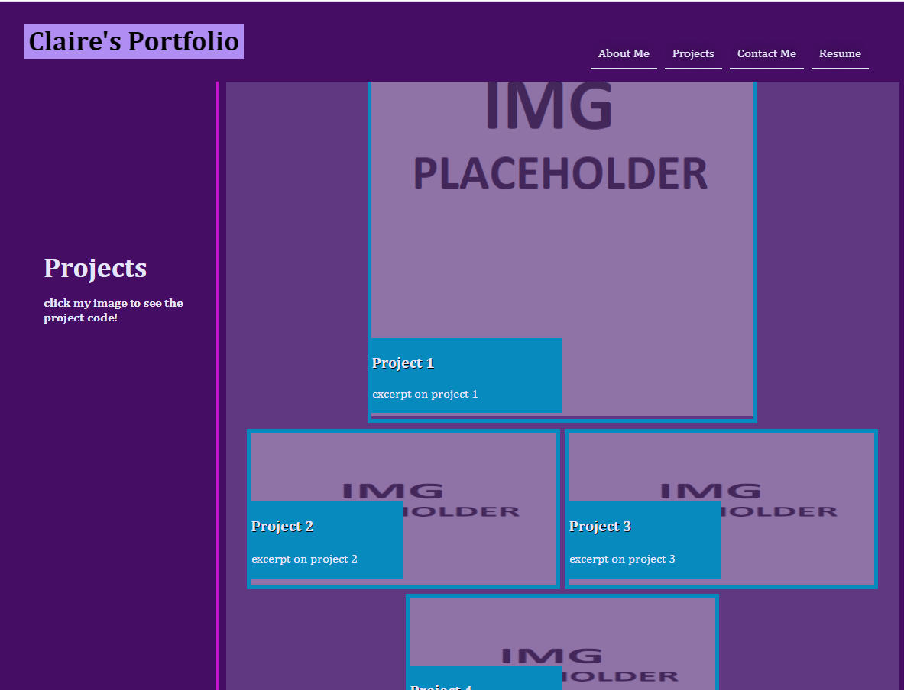

# Portfolio of Claire Cashmore (week 2 challenge)
<h2>Portfolio created during GWU's coding bootcamp</h2>

    <h3>Create a portfolio that meets the following requirements</h3>
    GIVEN I need to sample a potential employee's previous work
    WHEN I load their portfolio
    THEN I am presented with the developer's name, a recent photo or avatar, and links to sections about them, their work, and how to contact them
    WHEN I click one of the links in the navigation
    THEN the UI scrolls to the corresponding section
    WHEN I click on the link to the section about their work
    THEN the UI scrolls to a section with titled images of the developer's applications
    WHEN I am presented with the developer's first application
    THEN that application's image should be larger in size than the others
    WHEN I click on the images of the applications
    THEN I am taken to that deployed application
    WHEN I resize the page or view the site on various screens and devices
    THEN I am presented with a responsive layout that adapts to my viewport

<h2> Screen Capture of what my portfolio looks like on a screen larger than 980px </h2>
   
 

Deplyoment: https://clairecashmore17.github.io/portfolio_claire/
